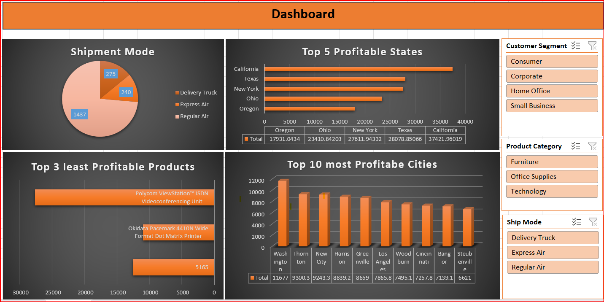

# [aqkhan's Portfolio](https://github.com/aqkhanhope-DA/Aqkhan-s-Portfolio)
# [📊 Project:1 Superstore Profitability Excel Dashboard](https://github.com/aqkhanhope-DA/Aqkhan-s-Portfolio?tab=readme-ov-file) 

This project presents an interactive Excel dashboard analyzing profitability trends across shipment modes, states, cities, and product categories using Pivot Tables, Pivot Charts, and Slicers.

### 🔍 Dashboard Highlights
- **Shipment Mode Analysis** – Distribution of Delivery Truck, Express Air, and Regular Air shipments.
- **Top 5 Most Profitable States** – Ranked based on total profit.
- **Top 10 Most Profitable Cities** – Identified strongest revenue-generating cities.
- **Bottom 3 Least Profitable Products** – Highlighted loss drivers for corrective action.
- **Interactive Slicers** – Filters for Customer Segment, Product Category, and Ship Mode.
  

### 🧾 Insights & Impact
- California and Texas dominate profitability, indicating strong regional performance.
- Certain products cause major loss and require pricing or discontinuation decisions.
- Shipment strategy optimization can further improve cost-to-profit ratio.

### 🛠 Tools Used
- Microsoft Excel (Pivot Tables, Pivot Charts, Slicers, Formatting)

This dashboard enables data-driven decisions by offering a quick and clear view of profitability across different business dimensions.
