# [Project:1 Crowdfunding Kickstarter Project Analysis]()

## Business Problem & Objective
### Business Problem:
Crowdfunding platforms generate large amounts of raw data (Epoch timestamps, currencies) that make trend analysis difficult.

### Objective:
To clean, model, and visualize crowdfunding data for insights into project success, funding amounts, and backer engagement.

# Data Sources
- **Projects.xlsx** – Details of all crowdfunding projects (goal, amount raised, dates).
- **Category.xlsx** – Project categories for analysis.
- **Location.xlsx** – Geographic location data for projects.
- **Creator.xlsx** – Information about project creators.
- **Projects.sql**- SQL file containing project database setup or queries
# Tools Used
- **Excel** – Data cleaning, Data Modeling, Pivot table, building dashboard
- **Power BI** – Data cleaning in PowerQuery, Dax calulations, Building charts and dashboard
- **Tableau** – Tableau, Calculation and Bulding Dashboard
- **SQL** – Data querying

# Data Preparation Steps
1. Convert Epoch time → Natural date
2. Build Calendar table with fiscal metrics
3. Create data model linking all files
4. Convert Goal to USD using static rate
5. Build KPIs in Power BI/Tableau

# 🕒 Date Conversion (Epoch → Human Readable Time)

The original dataset contained timestamps in epoch format (e.g., 1472688000), which are difficult to interpret for non-technical users.
I converted all epoch timestamps (such as campaign launch and deadline dates) into normal calendar dates (e.g., 2016-09-01) so that business users can easily understand and analyze time-based trends.

### Before Conversion:
1485972639 (epoch time)

#### After Conversion:
2/1/2017 (natural readable date)

This conversion makes the dashboard and reports clear for clients, founders, investors, and decision-makers who may not be familiar with epoch time.. 

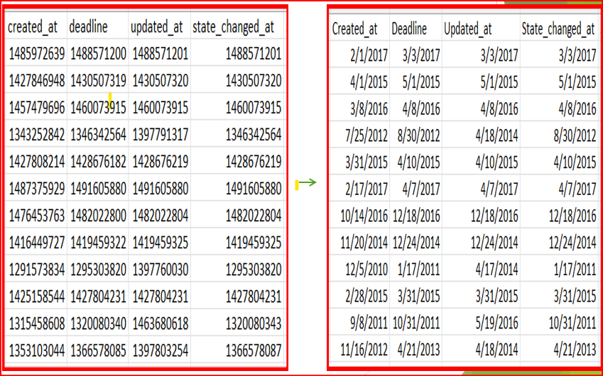

# 📅 Calendar Table Explanation

A Calendar (Date Dimension) table was added to enable accurate and flexible time-based analysis in this project.
It includes one row per date along with derived fields such as Year, Quarter, Month, Week, and Day names.

Using this table allows the dashboard to:

Group and filter campaigns by Month / Quarter / Year

Perform trend comparisons (MoM, YoY, QoQ)

Enable consistent time intelligence across all visuals

Avoid errors caused by missing or inconsistent date logic in the raw data

This ensures that all time-related insights in the dashboard are clear, reliable, and business-ready.

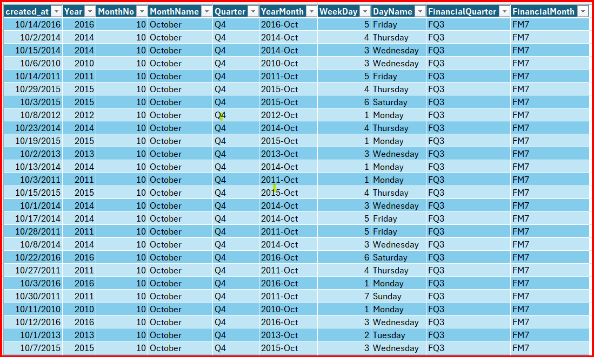

# Data Model
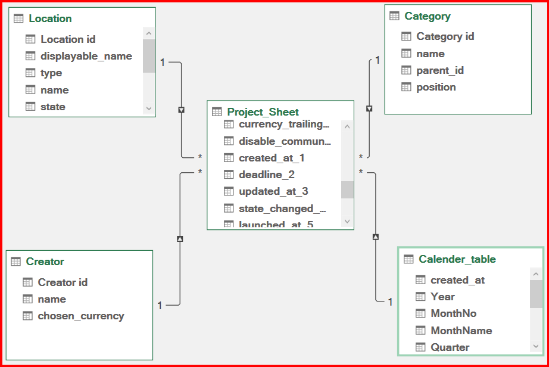

# KPIs & Insights
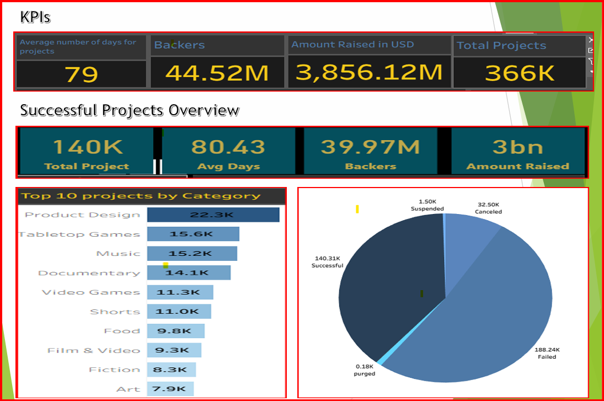

# Top Performing Projects
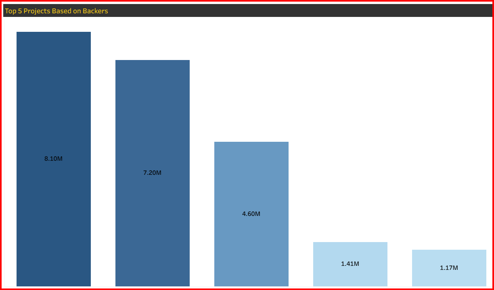 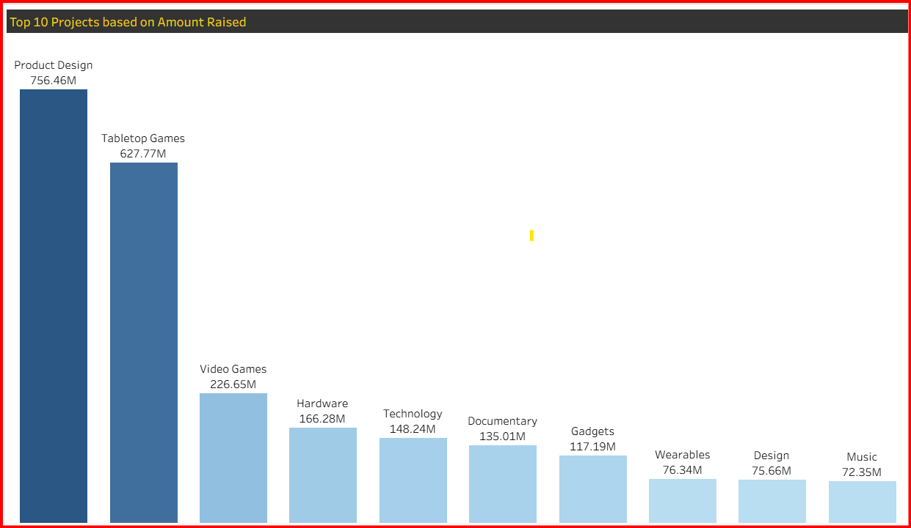
# Success Percentage Analysis
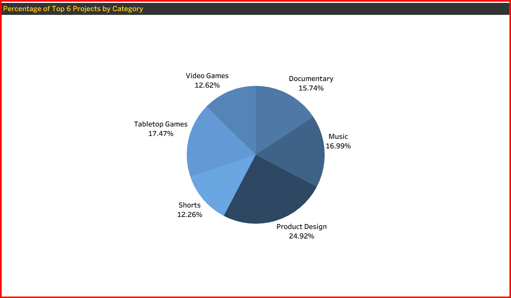
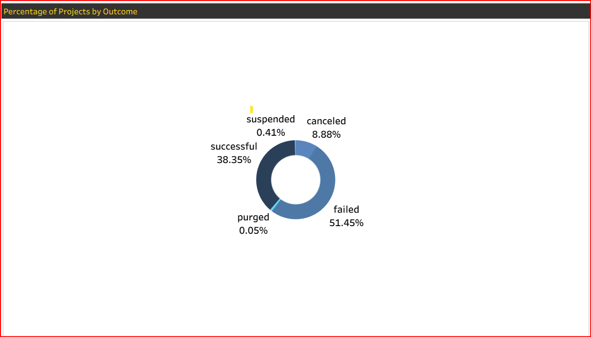
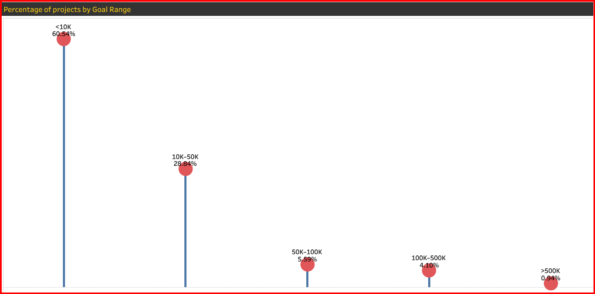
# SQL & DAX Highlights

# Key Findings
* Top Project categories: Product Design, Tabletop Games, Video Games, Hardware, Technology, Shorts, Documentary, Gadgets, Music
* Higher rates for projects with goals under $10K
*Lower rates for projects with goals above or equal to $500K
* Highest number of projects observed in the United States
* Lowest number of projects observed in the Togo, Seychelles, São Tomé and Príncipe
* Seasonal trend: Most projects Created in Q3 (July–September)
* Highest number of successful projects observed in Q1 (January–March)
* Lowest project success rate recorded in Q4 (October–December)

# Conclusion & Next Steps

## Conclusion:
* Data reveals key drivers of crowdfunding success
## Next Steps:
* Deploy dashboards online
* Automate currency updates
* Integrate live data APIs
# Dashboard

# 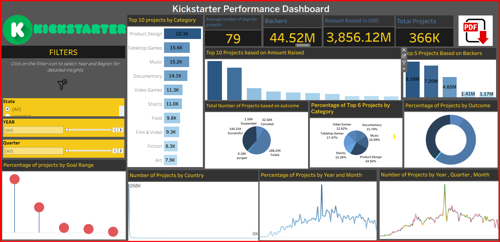

# 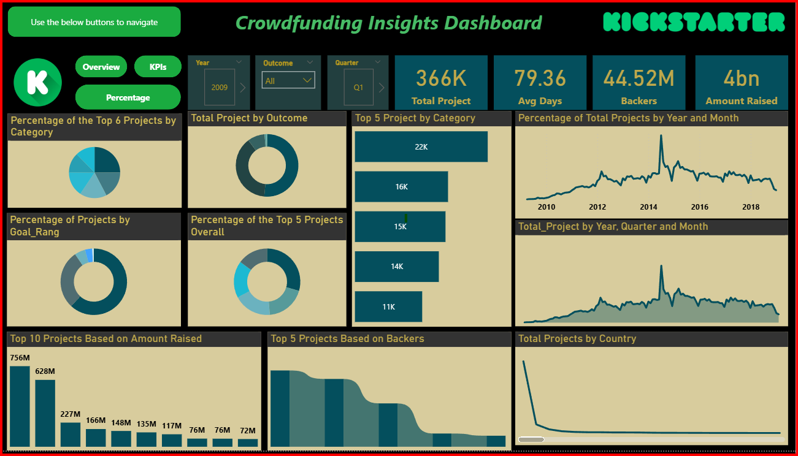

# 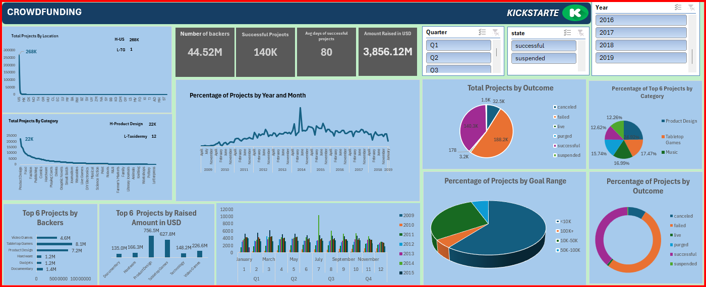

