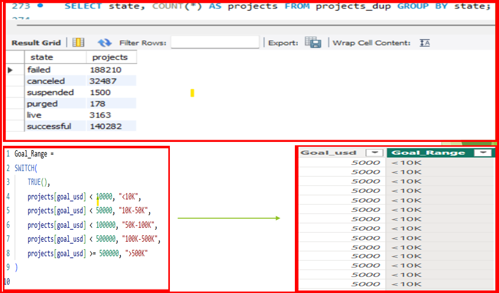

# [aqkhan's Portfolio](https://github.com/aqkhanhope-DA/Aqkhan-s-Portfolio)
# [📊 Project:1 Superstore Profitability Excel Dashboard](https://github.com/aqkhanhope-DA/Aqkhan-s-Portfolio?tab=readme-ov-file) 

This project presents an interactive Excel dashboard analyzing profitability trends across shipment modes, states, cities, and product categories using Pivot Tables, Pivot Charts, and Slicers.

### 🔍 Dashboard Highlights
- **Shipment Mode Analysis** – Distribution of Delivery Truck, Express Air, and Regular Air shipments.
- **Top 5 Most Profitable States** – Ranked based on total profit.
- **Top 10 Most Profitable Cities** – Identified strongest revenue-generating cities.
- **Bottom 3 Least Profitable Products** – Highlighted loss drivers for corrective action.
- **Interactive Slicers** – Filters for Customer Segment, Product Category, and Ship Mode.
  

### 🧾 Insights & Impact
- California and Texas dominate profitability, indicating strong regional performance.
- Certain products cause major loss and require pricing or discontinuation decisions.
- Shipment strategy optimization can further improve cost-to-profit ratio.

### 🛠 Tools Used
- Microsoft Excel (Pivot Tables, Pivot Charts, Slicers, Formatting)

This dashboard enables data-driven decisions by offering a quick and clear view of profitability across different business dimensions.

# [Project:2 Crowdfunding Kickstarter Project Analysis]()

## Business Problem & Objective
### Business Problem:
Crowdfunding platforms generate large amounts of raw data (Epoch timestamps, currencies) that make trend analysis difficult.

### Objective:
To clean, model, and visualize crowdfunding data for insights into project success, funding amounts, and backer engagement.

# Data Sources
- **Projects.xlsx** – Details of all crowdfunding projects (goal, amount raised, dates).
- **Category.xlsx** – Project categories for analysis.
- **Location.xlsx** – Geographic location data for projects.
- **Creator.xlsx** – Information about project creators.
- **Projects.sql**- SQL file containing project database setup or queries

- **Excel** – Data cleaning and preparation
- **Power BI** – Dashboard building and reporting
- **Tableau** – Data visualization and analysis
- **SQL** – Data querying and joins

# Data Preparation Steps
1. Convert Epoch time → Natural date
2. Build Calendar table with fiscal metrics
3. Create data model linking all files
4. Convert Goal to USD using static rate
5. Build KPIs in Power BI/Tableau

# Data transformation epoch to natural time Example

# Calendar Table Example

# Data Model

# KPIs & Insights

# Top Performing Projects
 
# Success Percentage Analysis

# SQL & DAX Highlights

# Key Findings
* Top Project categories: Product Design, Tabletop Games, Video Games, Hardware, Technology, Shorts, Documentary, Gadgets, Music
* Higher rates for projects with goals under $10K
*Lower rates for projects with goals above or equal to $500K
* Highest number of projects observed in the United States
* Lowest number of projects observed in the Togo, Seychelles, São Tomé and Príncipe
* Seasonal trend: Most projects Created in Q3 (July–September)
* Highest number of successful projects observed in Q1 (January–March)
* Lowest project success rate recorded in Q4 (October–December)

# Conclusion & Next Steps

## Conclusion:
* Data reveals key drivers of crowdfunding success
## Next Steps:
* Deploy dashboards online
* Automate currency updates
* Integrate live data APIs
# Dashboard

# 

# 

# 

